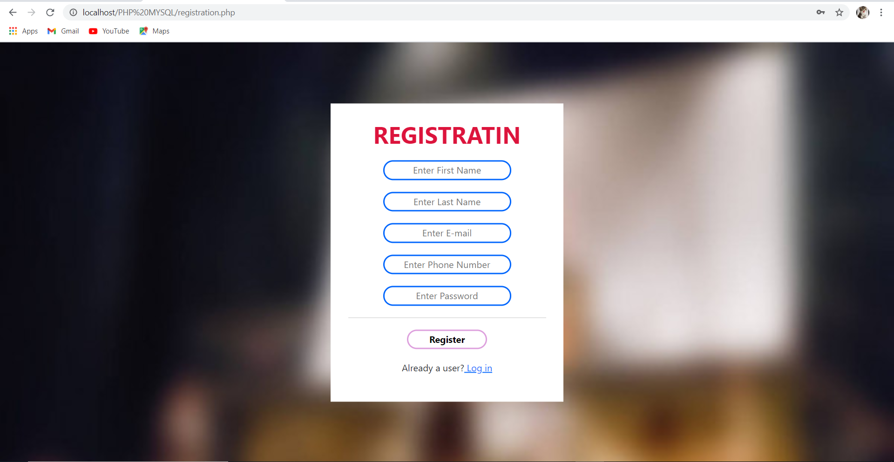
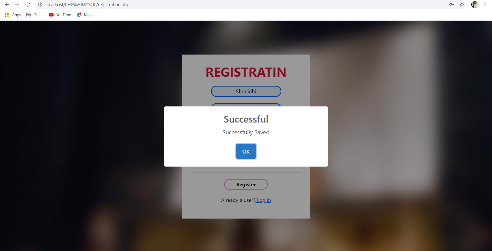

# MOVIE TICKETS BOOKING MANAGEMENT SYSTEM
AIM:
The main aim of our application is to automate the ticketing process for cinema hall.
So from this we can open up ourselves to the modern methods from the traditional method
of standing in queue and buying the tickets which in turn also helps us to save our time.

CUSTOMER LOGIN PAGE:

CUSTOMER REGISTRATION PAGE:

ADMIN LOGIN PAGE:

DATABASE:

