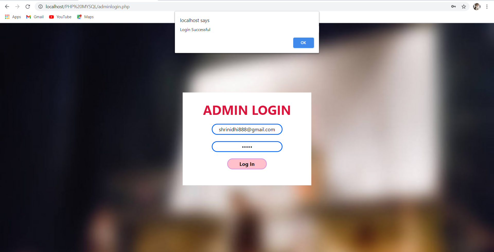
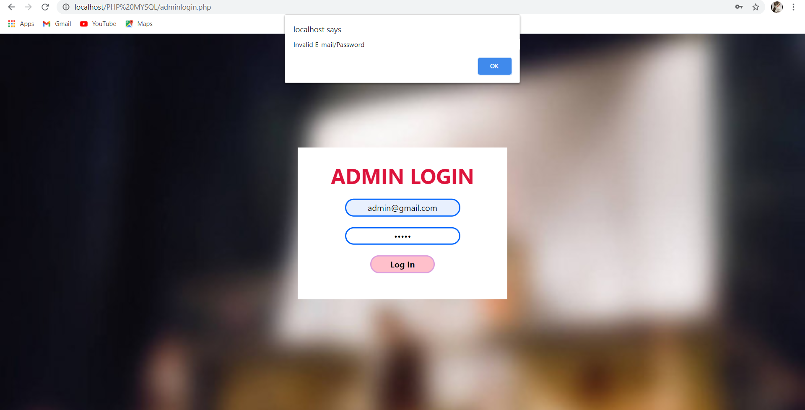

# MOVIE TICKETS BOOKING MANAGEMENT SYSTEM
AIM:
The main aim of our application is to automate the ticketing process for cinema hall.
So from this we can open up ourselves to the modern methods from the traditional method
of standing in queue and buying the tickets which in turn also helps us to save our time.

CUSTOMER LOGIN PAGE:It contains customer login window with Registration and Admin login option

CUSTOMER REGISTRATION PAGE:It contains customer Regisration window ,after clicking the reister button message will be popped as successfully saved

ADMIN LOGIN PAGE: It contains admin login window and when invalid E-mail or password is given eorror message will be popped as shown in figure

DATABASE:This image shows how the registerd values will be stored

